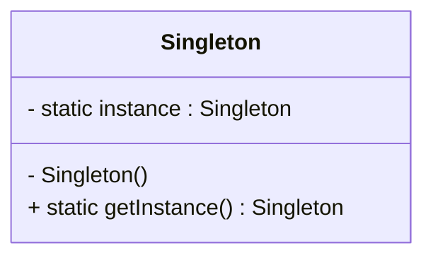

# Singleton

```
Singleton (127) Ensure a class only has one instance, and provide a global point of access to it.
```

**Quelle:**  
Erich Gamma, Richard Helm, Ralph Johnson, John Vlissides:  
*Design Patterns: Elements of Reusable Object-Oriented Software*, Addison-Wesley, 1994, S. 127ff.

---

## Zweck
Ensure a class only has one instance, and provide a global point of access to it.  
(Stellt sicher, dass eine Klasse nur eine Instanz hat, und bietet einen globalen Zugriffspunkt darauf.)

---

## Motivation
- Manchmal ist es notwendig, dass genau **eine Instanz** einer Klasse existiert (z. B. Window Manager, Logger, Konfigurationsobjekt).
- Direkter globaler Zugriff wird benötigt, ohne mehrere Objekte erzeugen zu können.

---

## Anwendbarkeit
Verwenden Sie Singleton, wenn:
- genau eine Instanz existieren muss und durch Unterklassenbildung erweiterbar ist,
- ein globaler Zugriffspunkt erforderlich ist,
- strenge Kontrolle über die Lebenszeit dieser Instanz nötig ist.

---

## Struktur


---

## Teilnehmer
- **Singleton**  
  - Definiert eine Klassenoperation `getInstance`, die eine einzige Instanz liefert.  
  - Hält eine private statische Referenz auf diese Instanz.  

---

## Zusammenarbeit
- Clients greifen über `Singleton.getInstance()` auf das einzige Objekt zu.

---

## Konsequenzen
- **Kontrollierter Zugriff** auf die einzige Instanz.  
- **Reduziert Namensraumverschmutzung** (kein globales Objekt, sondern Kapselung).  
- **Erlaubt Subklassenbildung** (z. B. unterschiedliche Singleton-Varianten).  
- **Erschwert das Testen** (globale Abhängigkeit).  
- **Lebenszyklussteuerung** liegt vollständig in der Klasse.  

---

## Beispiel (Java)

```java
public class Singleton {
    private static Singleton instance;

    private Singleton() {
        // privater Konstruktor verhindert direkte Instanziierung
    }

    public static synchronized Singleton getInstance() {
        if (instance == null) {
            instance = new Singleton();
        }
        return instance;
    }
}
```

---

## Verwandte Muster
- **Abstract Factory**, **Builder**, **Prototype** können als Singletons implementiert werden.  

