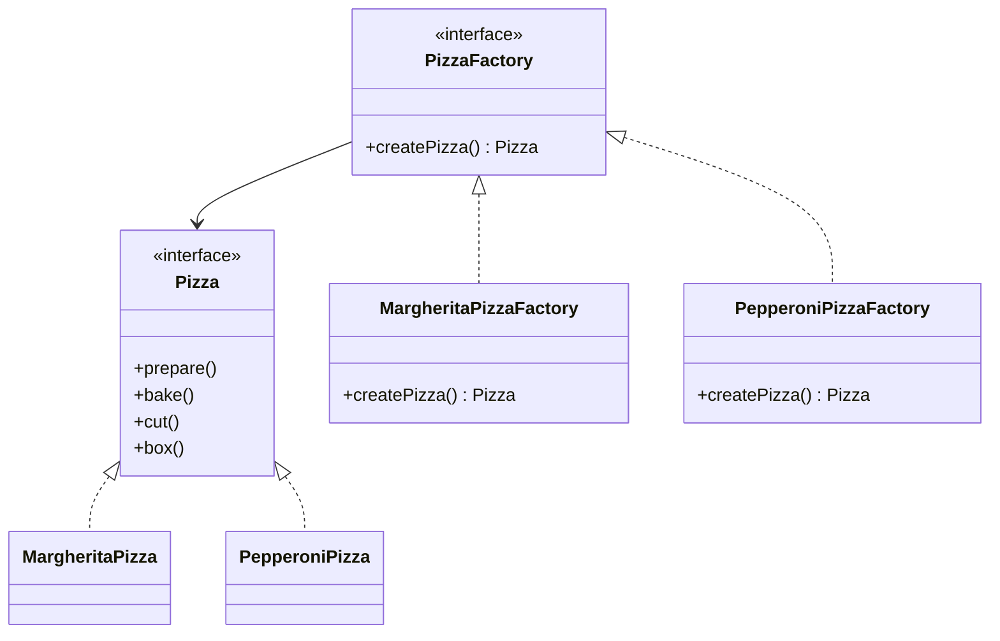
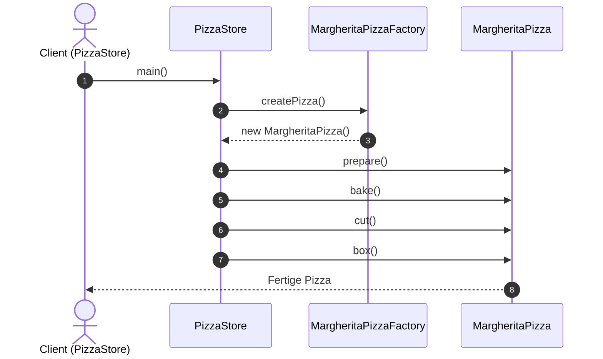

# Factory Method

```
Factory Method (107) Define an interface for creating an object, but let subclasses decide which class to instantiate. Factory Method lets a class defer instantiation to
subclasses.
```

**Quelle:**  
Erich Gamma, Richard Helm, Ralph Johnson, John Vlissides:  
*Design Patterns: Elements of Reusable Object-Oriented Software*, Addison-Wesley, 1994, S. 107ff.

---

## Zweck
Define an interface for creating an object, but let subclasses decide which class to instantiate.  
(Definiert ein Interface zur Objekterzeugung, aber überlässt den Subklassen die Entscheidung, welche konkrete Klasse instanziiert wird.)

---

## Motivation
- Frameworks sollen die **Objekterzeugung kapseln**, damit der Framework-Code unabhängig von konkreten Klassen bleibt.  
- Beispiel: Eine Pizzeria möchte unterschiedliche Pizzasorten (`Margherita`, `Pepperoni`) herstellen, ohne dass der Client-Code angepasst werden muss.  
- Die Subklassen entscheiden, welche **Produktklasse** konkret erzeugt wird.  

---

## Anwendbarkeit
Verwenden Sie Factory Method, wenn:  
- eine Klasse ihre Subklassen entscheiden lassen soll, **welche Objekte erzeugt** werden,  
- eine Klasse nicht vorab wissen kann, welche Klasse sie instanzieren muss,  
- ein Framework erstellt wird, das **erweiterbar** sein soll, ohne den Kerncode zu ändern.  

---

## Struktur


---
## Sequenzdiagramm

---

## Beispiel (Java)
Aus [Exploring the Factory Method Design Pattern](https://medium.com/@eshikashah2001/exploring-the-factory-method-design-pattern-4d270b6ff935)

```java
// Product interface
interface Pizza {
    void prepare();
    void bake();
    void cut();
    void box();
}

// ConcreteProduct implementations
class MargheritaPizza implements Pizza {
    public void prepare() { System.out.println("Preparing Margherita Pizza..."); }
    public void bake() { System.out.println("Baking Margherita Pizza..."); }
    public void cut() { System.out.println("Cutting Margherita Pizza..."); }
    public void box() { System.out.println("Boxing Margherita Pizza..."); }
}

class PepperoniPizza implements Pizza {
    public void prepare() { System.out.println("Preparing Pepperoni Pizza..."); }
    public void bake() { System.out.println("Baking Pepperoni Pizza..."); }
    public void cut() { System.out.println("Cutting Pepperoni Pizza..."); }
    public void box() { System.out.println("Boxing Pepperoni Pizza..."); }
}

// Creator interface
interface PizzaFactory {
    Pizza createPizza();
}

// ConcreteCreator implementations
class MargheritaPizzaFactory implements PizzaFactory {
    @Override
    public Pizza createPizza() {
        return new MargheritaPizza();
    }
}

class PepperoniPizzaFactory implements PizzaFactory {
    @Override
    public Pizza createPizza() {
        return new PepperoniPizza();
    }
}

// Client code
public class PizzaStore {
    public static void main(String[] args) {
        PizzaFactory pizzaFactory = new MargheritaPizzaFactory();
        Pizza pizza = pizzaFactory.createPizza();
        pizza.prepare();
        pizza.bake();
        pizza.cut();
        pizza.box();
    }
}
```

---

## Ergebnis
- Der Client-Code (`PizzaStore`) kennt nur das **Interface `Pizza`** und das **Factory-Interface `PizzaFactory`**.  
- Neue Pizzasorten können leicht hinzugefügt werden, indem neue `Pizza`- und `PizzaFactory`-Implementierungen erstellt werden.  
- Die Objekterzeugung wird **entkoppelt** vom Code, der die Objekte verwendet.  
